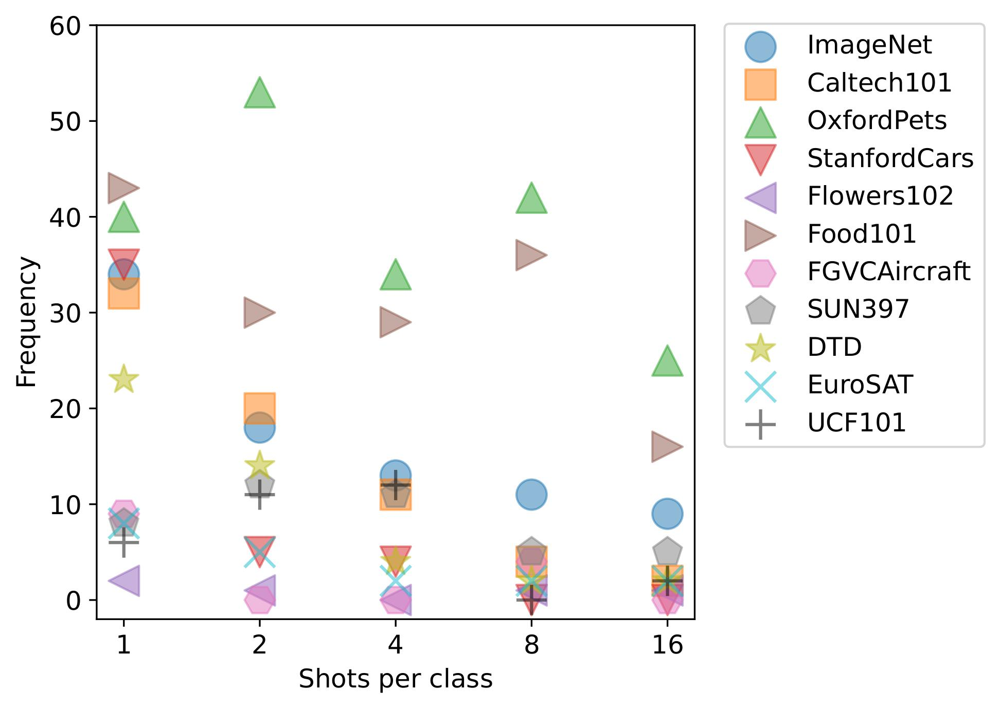
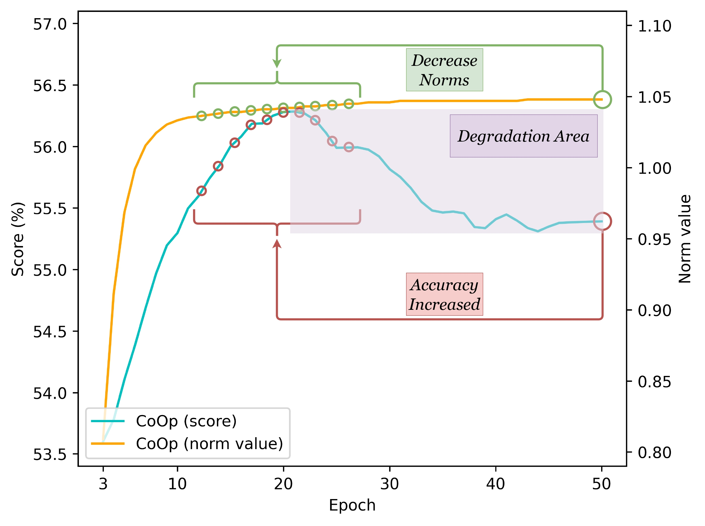
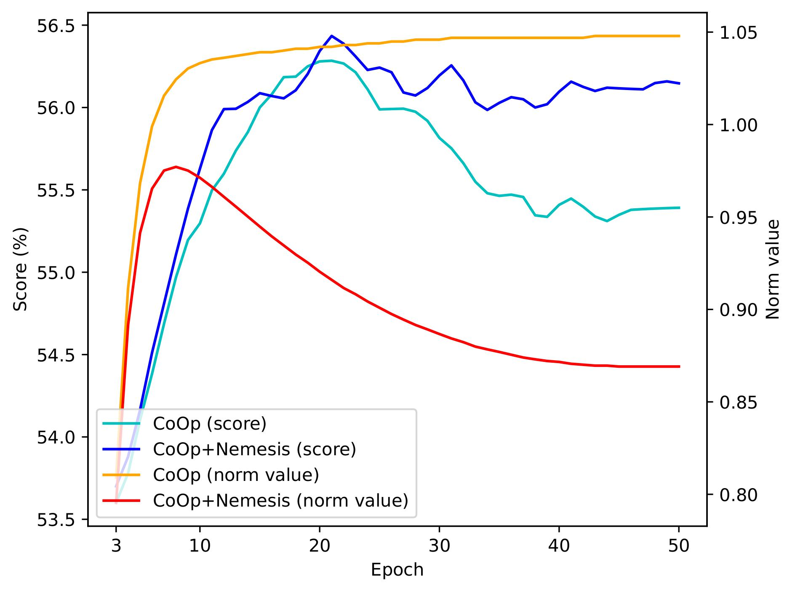
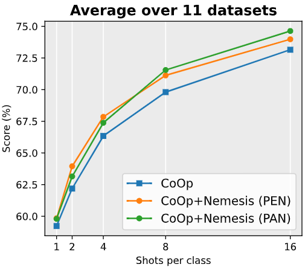
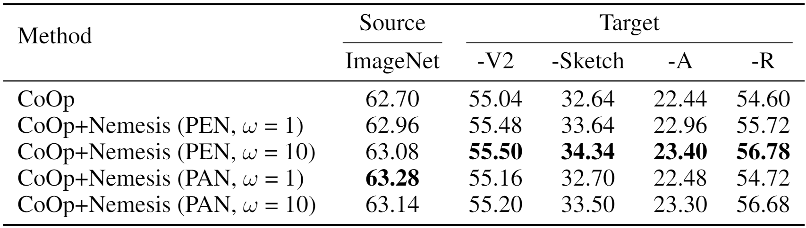
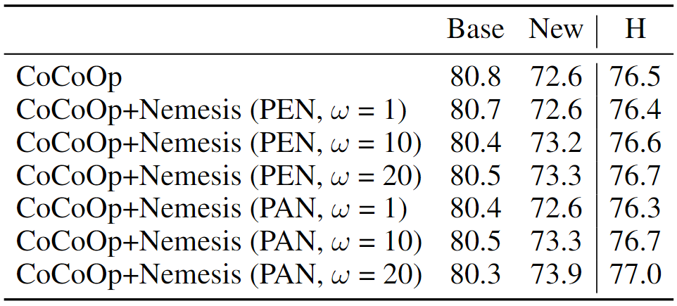

# Nemesis: Normalizing the Soft-prompt Vectors of Vision-Language Models

Paper Link: [Nemesis: Normalizing the Soft-prompt Vectors of Vision-Language Models](https://openreview.net/pdf?id=zmJDzPh1Dm)

## Highlights

To answer an unexplored research question: "Do we need to normalize the soft prompts in VLMs?", 
we first uncover a phenomenon, called the **Low-Norm Effect** by performing extensive corruption experiments,
suggesting that reducing the norms of certain learned prompts occasionally enhances the performance of VLMs,
while increasing them often degrades it.
To harness this effect, we propose a novel method named 
**N**ormalizing th**e** soft-pro**m**pt v**e**ctors of vi**si**on-language model**s** (**Nemesis**) to normalize soft-prompt vectors in VLMs. 
To the best of our knowledge, our work is the first to systematically investigate the role of norms of soft-prompt vector in VLMs,
offering valuable insights for future research in soft-prompt tuning.

Besides, we also conduct preliminary experiments to verify the generalizability and effectiveness of Nemesis on other **P**arameter-**EF**ficient **T**uning (**PEFT**) methods,
including [**visual prompt tuning**](https://github.com/KMnP/vpt) and [**prefix-tuning**](https://github.com/XiangLi1999/PrefixTuning). 
Detailed results can be found in the following tables.

## The Low-Norm Effect
<figure>
    
    <figcaption><strong><em>The schematic diagram of the Low-Norm Effect</em></strong></figcaption>
</figure>

A schematic diagram of the Low-Norm Effect: the reduction of norms at specific positions within these prompts enhances performance,
whereas an increase in norms typically results in performance deterioration. 
_**Top**_: corrupted soft prompts with increased norms leading to decreased performance;
_**Middle**_: soft prompts learned by CoOp; 
_**Bottom**_: corrupted soft prompts with reduced norms resulting in enhanced performance.

---
<figure>
    
    <figcaption><strong><em>The frequency of the Low-Norm Effect across 11 datasets</em></strong></figcaption>
</figure>

The 11 datasets have exhibited varying frequencies of the Low-Norm Effect. 
This observation indicates that tackling the Low-Norm Effect is a challenging task,
given its inconsistent manifestation across the 11 datasets.

---

<div style="display:flex; flex-direction: row">
    
    
</div>

From **the left figure**, 
it is apparent that the norms of soft prompts in CoOp first increase and then level off,
while test accuracy falls into degradation as norms slowly flatten out.
By performing corruption operations that decrease the norms of prompt vectors,
the last green circle may be pushed away from the degradation area and get closer to those small green circles that demonstrate superior performance.

From **the right figure**, 
we observe a distinct norm variation pattern in CoOp+Nemesis (ours) that differs from CoOp.
This pattern demonstrates an initial increase in norms, followed by a subsequent decrease,
and eventually reaching a stable state.
Furthermore, the test accuracy exhibits a consistent upward trend before reaching a plateau,
whereas a declining trend is observed in CoOp.

This implies that our method can delay the time point where soft prompts tend to plateau during the learning process,
thereby reducing the probability of learning degradation.

## Main Results
<figure>
    <figcaption><strong><em>Few-shot classification</em></strong></figcaption>
    
</figure>

<figure>
    <figcaption><strong><em>Domain generalization</em></strong></figcaption>
    
</figure>

<figure>
    <figcaption><strong><em>Base-to-new generalization</em></strong></figcaption>
    
</figure>

## How to Run

First, you should follow the instructions in [DATASETS.md](./DATASETS.md) to download datasets.

Next, you should follow the intructions in [Dassl.pytorch](https://github.com/KaiyangZhou/Dassl.pytorch) to install the `dassl` environment.

Finally, we provide the running scripts in `./scripts`, which allow you to reproduce the results.

Make sure you change the path in bash file (`/path/to/dataset`) and run the commands under different paths,
including `coop`, `coop_crt` (coop+corruption), `coop_nemesis`, `plot`, `plot_nemesis`.

The running commands of few-shot learning, domain generalization, base-to-new tasks can refer to [COOP.md](COOP.md). 

Here, we provide examples on how to conduct corruption experiments based on CoOp (`./scripts/coop_crt/eval_loop.sh`):
### Corruption Experiments
```bash
# original
CUDA_VISIBLE_DEVICES=0 bash scripts/coop_crt/eval.sh rn50_ep50 end 16 1 False 50 original 666 666
CUDA_VISIBLE_DEVICES=0 bash scripts/coop_crt/eval.sh rn50_ep50 end 16 2 False 50 original 666 666
CUDA_VISIBLE_DEVICES=0 bash scripts/coop_crt/eval.sh rn50_ep100 end 16 4 False 100 original 666 666
CUDA_VISIBLE_DEVICES=0 bash scripts/coop_crt/eval.sh rn50_ep100 end 16 8 False 100 original 666 666
CUDA_VISIBLE_DEVICES=0 bash scripts/coop_crt/eval.sh rn50 end 16 16 False 200 original 666 666
# replace
CUDA_VISIBLE_DEVICES=0 bash scripts/coop_crt/eval.sh rn50_ep50 end 16 1 False 100 replace 0 0.
CUDA_VISIBLE_DEVICES=0 bash scripts/coop_crt/eval.sh rn50_ep50 end 16 1 False 100 replace 1 0.
CUDA_VISIBLE_DEVICES=0 bash scripts/coop_crt/eval.sh rn50_ep50 end 16 1 False 100 replace 2 0.
# rescale
CUDA_VISIBLE_DEVICES=0 bash scripts/coop_crt/eval.sh rn50_ep50 end 16 1 False 100 scale 0 0.001
CUDA_VISIBLE_DEVICES=0 bash scripts/coop_crt/eval.sh rn50_ep50 end 16 1 False 100 scale 1 0.001
CUDA_VISIBLE_DEVICES=0 bash scripts/coop_crt/eval.sh rn50_ep50 end 16 1 False 100 scale 2 0.001
```
P.S. the last two parameters represent the corrupt position and the corruption weight in corruption experiments, respectively.
Hence, they can be set as any number like 666 in the original evaluation since they are not used in this experiment.

## Citation
If you use this code in your research, please kindly cite the following paper:
```bibtex
@inproceedings{nemesis,
  title={Nemesis: Normalizing the Soft-prompt Vectors of Vision-Language Models},
  author={Fu, Shuai and Wang, Xiequn and Huang, Qiushi and Zhang, Yu},
 booktitle={The Twelfth International
Conference on Learning Representations},
  year={2024}
}
```


## Acknowledgements
Our code is based on [CoOp](https://github.com/KaiyangZhou/CoOp). 
We thank the authors for releasing their code. 
If you use our model and code, please consider citing this work as well.
