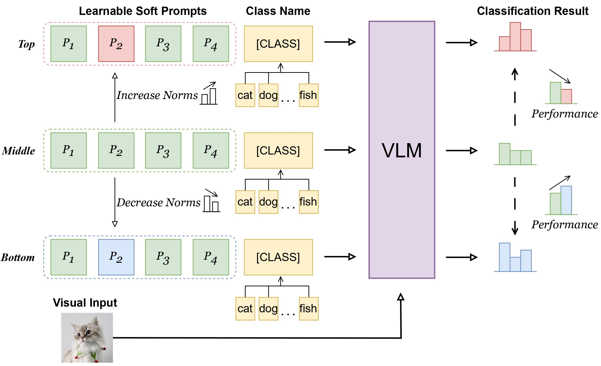

# Nemesis: Normalizing the Soft-prompt Vectors of Vision-Language Models (ICLR 2024 Spotlight)

Paper Link: [Nemesis: Normalizing the Soft-prompt Vectors of Vision-Language Models](https://openreview.net/pdf?id=zmJDzPh1Dm)

## Highlights

To answer an unexplored research question: "Do we need to normalize the soft prompts in VLMs?", 
we first uncover a phenomenon, called the **Low-Norm Effect** by performing extensive corruption experiments,
suggesting that reducing the norms of certain learned prompts occasionally enhances the performance of VLMs,
while increasing them often degrades it.
To harness this effect, we propose a novel method named **N**ormalizing th**e** soft-pro**m**pt v**e**ctors of vi**si**on-language model**s** (**Nemesis**) to normalize soft-prompt vectors in VLMs. 
To the best of our knowledge, our work is the first to systematically investigate the role of norms of soft-prompt vector in VLMs,
offering valuable insights for future research in soft-prompt tuning.

Besides, we also conduct preliminary to verify the generalizability and effectiveness of Nemesis on other **P**arameter-**EF**ficient **T**uning (**PEFT**) methods,
including visual prompt tuning ([**VPT**](https://github.com/KMnP/vpt)) and [**Prefix-tuning**](https://github.com/XiangLi1999/PrefixTuning). 
Detailed results can be found in the following tables.

## The Low-Norm Effect
 


[//]: # ()
[//]: # (This repo contains the codebase of a series of research projects focused on adapting vision-language models like [CLIP]&#40;https://arxiv.org/abs/2103.00020&#41; to downstream datasets via *prompt learning*:)

[//]: # ()
[//]: # (* [Conditional Prompt Learning for Vision-Language Models]&#40;https://arxiv.org/abs/2203.05557&#41;, in CVPR, 2022.)

[//]: # (* [Learning to Prompt for Vision-Language Models]&#40;https://arxiv.org/abs/2109.01134&#41;, IJCV, 2022.)

[//]: # ()
[//]: # (## Updates)

[//]: # ()
[//]: # (- **07.10.2022**: Just added to both [CoOp]&#40;https://arxiv.org/abs/2109.01134&#41; and [CoCoOp]&#40;https://arxiv.org/abs/2203.05557&#41; &#40;in their appendices&#41; the results on the newly proposed DOSCO &#40;DOmain Shift in COntext&#41; benchmark, which focuses on contextual domain shift and covers a diverse set of classification problems. &#40;The paper about DOSCO is [here]&#40;https://arxiv.org/abs/2209.07521&#41; and the code for running CoOp/CoCoOp on DOSCO is [here]&#40;https://github.com/KaiyangZhou/on-device-dg&#41;.&#41;)

[//]: # ()
[//]: # (- **17.09.2022**: [Call for Papers]&#40;https://kaiyangzhou.github.io/assets/cfp_ijcv_lvms.html&#41;: IJCV Special Issue on *The Promises and Dangers of Large Vision Models*.)

[//]: # ()
[//]: # (- **16.07.2022**: CoOp has been accepted to IJCV for publication!)

[//]: # ()
[//]: # (- **10.06.2022**: Our latest work, [Neural Prompt Search]&#40;https://arxiv.org/abs/2206.04673&#41;, has just been released on arxiv. It provides a novel perspective for fine-tuning large vision models like [ViT]&#40;https://arxiv.org/abs/2010.11929&#41;, so please check it out if you're interested in parameter-efficient fine-tuning/transfer learning. The code is also made public [here]&#40;https://github.com/Davidzhangyuanhan/NOAH&#41;.)

[//]: # ()
[//]: # (- **08.06.2022**: If you're looking for the code to draw the few-shot performance curves &#40;like the ones we show in the CoOp's paper&#41;, see `draw_curves.py`.)

[//]: # ()
[//]: # (- **09.04.2022**: The pre-trained weights of CoOp on ImageNet are released [here]&#40;#pre-trained-models&#41;.)

[//]: # ()
[//]: # (- **11.03.2022**: The code of our CVPR'22 paper, "[Conditional Prompt Learning for Vision-Language Models]&#40;https://arxiv.org/abs/2203.05557&#41;," is released.)

[//]: # ()
[//]: # (- **15.10.2021**: We find that the `best_val` model and the `last_step` model achieve similar performance, so we set `TEST.FINAL_MODEL = "last_step"` for all datasets to save training time. Why we used `best_val`: the &#40;[tiny]&#40;https://github.com/KaiyangZhou/CoOp/blob/main/datasets/oxford_pets.py#L32&#41;&#41; validation set was designed for the linear probe approach, which requires extensive tuning for its hyperparameters, so we used the `best_val` model for CoOp as well for fair comparison &#40;in this way, both approaches have access to the validation set&#41;.)

[//]: # ()
[//]: # (- **09.10.2021**: Important changes are made to Dassl's transforms.py. Please pull the latest commits from https://github.com/KaiyangZhou/Dassl.pytorch and this repo to make sure the code works properly. In particular, 1&#41; `center_crop` now becomes a default transform in testing &#40;applied after resizing the smaller edge to a certain size to keep the image aspect ratio&#41;, and 2&#41; for training, `Resize&#40;cfg.INPUT.SIZE&#41;` is deactivated when `random_crop` or `random_resized_crop` is used. Please read this [issue]&#40;https://github.com/KaiyangZhou/CoOp/issues/8&#41; on how these changes might affect the performance.)

[//]: # ()
[//]: # (- **18.09.2021**: We have fixed an error in Dassl which could cause a training data loader to have zero length &#40;so no training will be performed&#41; when the dataset size is smaller than the batch size &#40;due to `drop_last=True`&#41;. Please pull the latest commit for Dassl &#40;>= `8eecc3c`&#41;. This error led to lower results for CoOp in EuroSAT's 1- and 2-shot settings &#40;others are all correct&#41;. We will update the paper on arxiv to fix this error.)

[//]: # ()
[//]: # (## How to Install)

[//]: # (This code is built on top of the awesome toolbox [Dassl.pytorch]&#40;https://github.com/KaiyangZhou/Dassl.pytorch&#41; so you need to install the `dassl` environment first. Simply follow the instructions described [here]&#40;https://github.com/KaiyangZhou/Dassl.pytorch#installation&#41; to install `dassl` as well as PyTorch. After that, run `pip install -r requirements.txt` under `CoOp/` to install a few more packages required by [CLIP]&#40;https://github.com/openai/CLIP&#41; &#40;this should be done when `dassl` is activated&#41;. Then, you are ready to go.)

[//]: # ()
[//]: # (Follow [DATASETS.md]&#40;DATASETS.md&#41; to install the datasets.)

[//]: # ()
[//]: # (## How to Run)

[//]: # ()
[//]: # (Click a paper below to see the detailed instructions on how to run the code to reproduce the results.)

[//]: # ()
[//]: # (* [Learning to Prompt for Vision-Language Models]&#40;COOP.md&#41;)

[//]: # (* [Conditional Prompt Learning for Vision-Language Models]&#40;COCOOP.md&#41;)

[//]: # ()
[//]: # (## Models and Results)

[//]: # ()
[//]: # (- The pre-trained weights of CoOp &#40;both M=16 & M=4&#41; on ImageNet based on RN50, RN101, ViT-B/16 and ViT-B/32 can be downloaded altogether via this [link]&#40;https://drive.google.com/file/d/18ypxfd82RR0pizc5MM1ZWDYDk4j0BtPF/view?usp=sharing&#41;. The weights can be used to reproduce the results in Table 1 of CoOp's paper &#40;i.e., the results on ImageNet and its four variants with domain shift&#41;. To load the weights and run the evaluation code, you will need to specify `--model-dir` and `--load-epoch` &#40;see this [script]&#40;https://github.com/KaiyangZhou/CoOp/blob/main/scripts/eval.sh&#41; for example&#41;.)

[//]: # (- The raw numerical results can be found at this [google drive link]&#40;https://docs.google.com/spreadsheets/d/12_kaFdD0nct9aUIrDoreY0qDunQ9q9tv/edit?usp=sharing&ouid=100312610418109826457&rtpof=true&sd=true&#41;.)

[//]: # ()
[//]: # (## Citation)

[//]: # (If you use this code in your research, please kindly cite the following papers)

[//]: # ()
[//]: # (```bash)

[//]: # (@inproceedings{zhou2022cocoop,)

[//]: # (    title={Conditional Prompt Learning for Vision-Language Models},)

[//]: # (    author={Zhou, Kaiyang and Yang, Jingkang and Loy, Chen Change and Liu, Ziwei},)

[//]: # (    booktitle={IEEE/CVF Conference on Computer Vision and Pattern Recognition &#40;CVPR&#41;},)

[//]: # (    year={2022})

[//]: # (})

[//]: # ()
[//]: # (@article{zhou2022coop,)

[//]: # (    title={Learning to Prompt for Vision-Language Models},)

[//]: # (    author={Zhou, Kaiyang and Yang, Jingkang and Loy, Chen Change and Liu, Ziwei},)

[//]: # (    journal={International Journal of Computer Vision &#40;IJCV&#41;},)

[//]: # (    year={2022})

[//]: # (})

[//]: # (```)
